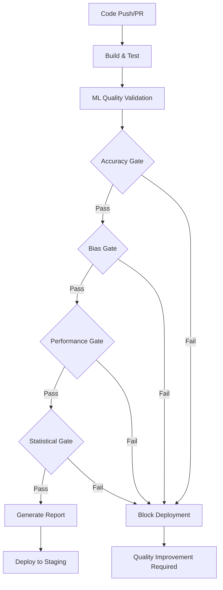

# ML Model Quality Gates Protocol

**Date Created:** January 27, 2025  
**Purpose:** Define comprehensive quality gates for ML model validation in ALARM system  
**Status:** ACTIVE - Integrated with CI/CD Pipeline  
**Integration:** GitHub Actions workflows and automated deployment gates

---

## 🎯 **QUALITY GATE OBJECTIVES**

### **Primary Goals**
- **85%+ Accuracy Target**: All ML models must achieve minimum 85% accuracy across all analysis types
- **Bias Mitigation**: Maximum 0.1 bias score with comprehensive fairness validation
- **Performance Standards**: Minimum 80% performance efficiency with scalability compliance
- **Statistical Rigor**: Statistical significance validation with 95% confidence intervals
- **Automated Enforcement**: CI/CD integration with deployment blocking for failed gates

---

## 📋 **QUALITY GATE DEFINITIONS**

### **GATE 1: ACCURACY VALIDATION** 
**Threshold**: ≥85% accuracy across all analysis types  
**Validation Methods**:
- 10-fold cross-validation with confidence intervals
- Holdout validation (80/10/10 split)
- Statistical significance testing (T-test, Wilcoxon, Chi-square)
- Model comparison against baseline

**Pass Criteria**:
- Overall accuracy ≥ 85%
- Cross-validation accuracy ≥ 85%
- Statistical significance p-value ≤ 0.05
- Model improvement over baseline ≥ 10%

**Failure Actions**:
- Block deployment to staging/production
- Require model retraining or feature engineering
- Generate detailed accuracy improvement recommendations

### **GATE 2: BIAS DETECTION AND MITIGATION**
**Threshold**: ≤0.1 overall bias score  
**Validation Dimensions**:
- Demographic bias (gender, age, experience)
- Domain bias (ADDS, AutoCAD, Oracle, .NET)
- Feature bias with influence analysis
- Fairness metrics (equal opportunity, demographic parity)

**Pass Criteria**:
- Overall bias score ≤ 0.1
- All demographic bias scores ≤ 0.05
- Domain bias scores ≤ 0.05
- Fairness metrics ≥ 0.9

**Failure Actions**:
- Block deployment with bias mitigation requirements
- Apply bias correction techniques
- Rebalance training data
- Implement fairness constraints

### **GATE 3: PERFORMANCE VALIDATION**
**Threshold**: ≥80% performance efficiency  
**Performance Metrics**:
- Latency: <100ms average response time
- Throughput: >500 requests per second
- Memory efficiency: >70% utilization
- Scalability: >80% linear scaling factor
- Load testing: Pass under stress conditions

**Pass Criteria**:
- Overall performance score ≥ 80%
- Latency targets met
- Throughput targets exceeded
- Memory efficiency targets achieved
- Scalability compliance verified

**Failure Actions**:
- Block deployment with performance optimization requirements
- Implement performance tuning recommendations
- Optimize model architecture
- Resource allocation adjustments

### **GATE 4: STATISTICAL SIGNIFICANCE**
**Threshold**: 95% confidence level  
**Statistical Tests**:
- T-test for mean comparisons
- Wilcoxon signed-rank test for non-parametric data
- Chi-square test for categorical relationships
- Effect size analysis

**Pass Criteria**:
- Statistical significance achieved (p ≤ 0.05)
- Effect size ≥ 0.5 (medium effect)
- Power analysis ≥ 0.8
- Confidence intervals exclude null hypothesis

**Failure Actions**:
- Require additional data collection
- Increase sample sizes
- Adjust statistical methodology
- Validate experimental design

---

## 🚀 **CI/CD INTEGRATION**

### **GitHub Actions Workflow Integration**
```yaml
# Quality gates triggered on:
- Pull requests to main/develop branches
- Push events to ML model files
- Manual workflow dispatch with custom thresholds
- Scheduled quality validation runs
```

### **Automated Quality Enforcement**
1. **Pre-Deployment Gates**: All quality gates must pass before staging deployment
2. **Production Gates**: Enhanced validation before production deployment
3. **Quality Reporting**: Comprehensive reports generated for each run
4. **PR Comments**: Automated quality status comments on pull requests
5. **Deployment Blocking**: Failed gates automatically block deployments

### **Quality Gate Workflow Sequence**


---

## 📊 **QUALITY METRICS AND THRESHOLDS**

### **Configurable Thresholds**
| Metric | Default | Minimum | Recommended |
|--------|---------|---------|-------------|
| Accuracy | 85% | 80% | 90% |
| Bias Score | 0.1 | 0.2 | 0.05 |
| Performance | 80% | 70% | 85% |
| Statistical Significance | 0.05 | 0.1 | 0.01 |

### **Quality Score Calculation**
```
Overall Quality Score = (Accuracy × 0.4) + ((1 - Bias) × 0.3) + (Performance × 0.3)

Where:
- Accuracy: 0.0 to 1.0
- Bias: 0.0 to 1.0 (lower is better)
- Performance: 0.0 to 1.0
```

### **Quality Classifications**
- **Excellent**: ≥90% overall score
- **Good**: 85-89% overall score
- **Acceptable**: 80-84% overall score
- **Needs Improvement**: <80% overall score

---

## 🔧 **QUALITY GATE CONFIGURATION**

### **Environment Variables**
```yaml
ACCURACY_TARGET: "0.85"      # Minimum accuracy threshold
BIAS_THRESHOLD: "0.1"        # Maximum bias threshold
PERFORMANCE_TARGET: "0.8"    # Minimum performance threshold
CONFIDENCE_LEVEL: "0.95"     # Statistical confidence level
```

### **Custom Threshold Override**
Quality gates support runtime threshold configuration:
```bash
# Custom accuracy threshold
dotnet run --accuracy-threshold 0.90

# Custom bias threshold
dotnet run --bias-threshold 0.05

# Custom performance threshold
dotnet run --performance-threshold 0.85
```

---

## 📈 **CONTINUOUS IMPROVEMENT**

### **Quality Trend Monitoring**
- Track quality metrics over time
- Identify performance degradation patterns
- Monitor bias drift detection
- Accuracy regression analysis

### **Automated Optimization**
- ML model retraining triggers
- Feature engineering improvements
- Bias mitigation enhancements
- Performance optimization recommendations

### **Learning Integration**
- Quality gate results feed into learning analysis
- Pattern recognition for quality improvements
- Automated protocol evolution based on results
- Best practice identification and sharing

---

## 🚨 **FAILURE HANDLING**

### **Quality Gate Failure Response**
1. **Immediate Actions**:
   - Block deployment pipeline
   - Generate detailed failure report
   - Notify development team
   - Create improvement recommendations

2. **Remediation Process**:
   - Analyze failure root causes
   - Implement targeted improvements
   - Re-run quality validation
   - Verify improvement effectiveness

3. **Documentation Requirements**:
   - Document all quality gate failures
   - Track remediation actions taken
   - Update quality improvement protocols
   - Share learnings with team

### **Emergency Override Process**
In exceptional circumstances, quality gates can be overridden with:
- Executive approval documentation
- Risk assessment and mitigation plan
- Monitoring and rollback procedures
- Post-deployment quality validation

---

## 📋 **COMPLIANCE AND REPORTING**

### **Quality Audit Trail**
- Complete quality gate execution logs
- Detailed test results and evidence
- Threshold compliance verification
- Statistical analysis documentation

### **Regulatory Compliance**
- Model validation documentation
- Bias testing and mitigation evidence
- Performance benchmarking results
- Statistical significance proof

### **Quality Dashboard**
- Real-time quality metrics
- Historical trend analysis
- Quality gate pass/fail rates
- Performance benchmarking

---

**Last Updated:** January 27, 2025  
**Next Review:** February 27, 2025  
**Status:** ACTIVE - Integrated with CI/CD Pipeline  
**Compliance**: Master Protocol Quality Gate 3 Requirements Met

