# Session Log: Phase 2 Week 3 CI/CD Pipeline Integration

**Date**: January 27, 2025  
**Session Focus**: CI/CD Pipeline Integration for ML Model Testing Framework  
**Status**: ✅ COMPLETED - Comprehensive Integration Achieved  

## 🎯 **DELIVERABLES COMPLETED**

### 1. **Enhanced Main CI/CD Pipeline**
- **File**: `ci/build.yml`
- **Integration Points**:
  - Added ML Testing Framework to build and restore steps
  - Integrated new `ml-model-testing` job with comprehensive validation
  - Updated deployment dependencies to include ML testing validation
  - Enhanced learning analysis to incorporate ML testing results
- **Quality Gates Integration**:
  - Accuracy validation with 85%+ threshold enforcement
  - Bias detection with <0.1 threshold compliance
  - Performance testing with 80%+ efficiency requirements
  - Statistical significance validation with 95% confidence

### 2. **Dedicated ML Quality Gates Workflow**
- **File**: `.github/workflows/ml-quality-gates.yml`
- **Comprehensive Quality Validation**:
  - Automated accuracy validation with configurable thresholds
  - Advanced bias detection across demographic and domain dimensions
  - Performance benchmarking with latency, throughput, and scalability testing
  - Statistical significance validation with confidence intervals
- **Advanced Features**:
  - Pull request integration with automated status comments
  - Quality badge generation for repository status
  - Deployment blocking for failed quality gates
  - Comprehensive artifact collection and retention

### 3. **ML Quality Gates Protocol**
- **File**: `mcp/protocols/ml-quality-gates.md`
- **Comprehensive Documentation**:
  - Detailed quality gate definitions and thresholds
  - CI/CD integration specifications
  - Quality metrics calculation formulas
  - Failure handling and remediation procedures
- **Quality Standards**:
  - 85%+ accuracy requirement across all analysis types
  - <0.1 bias threshold with fairness metrics validation
  - 80%+ performance efficiency with scalability compliance
  - Statistical significance with 95% confidence intervals

## 📊 **CI/CD INTEGRATION ACHIEVEMENTS**

### **Automated Quality Enforcement**
- **Pre-Deployment Gates**: All quality gates must pass before staging deployment
- **Production Blocking**: Enhanced validation prevents production deployment of failing models
- **Real-Time Feedback**: PR comments provide immediate quality status updates
- **Artifact Management**: Comprehensive test results and reports retained for analysis

### **Quality Gate Workflow**

```mermaid
graph TD
    A[Code Push/PR] --> B[Build & Test]
    B --> C[ML Quality Validation]
    C --> D{Accuracy ≥85%?}
    D -->|Yes| E{Bias ≤0.1?}
    D -->|No| F[Block Deployment]
    E -->|Yes| G{Performance ≥80%?}
    E -->|No| F
    G -->|Yes| H{Statistical Significance?}
    G -->|No| F
    H -->|Yes| I[Deploy to Staging]
    H -->|No| F
    F --> J[Generate Improvement Recommendations]
```


### **Integration Points**
1. **Main CI/CD Pipeline**: Enhanced `ci/build.yml` with ML testing job
2. **Quality Gates Workflow**: Dedicated `.github/workflows/ml-quality-gates.yml`
3. **Protocol Documentation**: Comprehensive `mcp/protocols/ml-quality-gates.md`
4. **Automated Reporting**: Quality status badges and PR comments
5. **Deployment Blocking**: Failed gates automatically prevent deployments

## 🛠️ **TECHNICAL CAPABILITIES**

### **Automated Quality Validation**
- **Accuracy Validation**: Cross-validation, holdout validation, statistical testing
- **Bias Detection**: Demographic, domain, and feature bias analysis
- **Performance Testing**: Latency, throughput, memory, scalability validation
- **Statistical Rigor**: Confidence intervals and significance testing

### **CI/CD Features**
- **Configurable Thresholds**: Runtime threshold adjustment via workflow inputs
- **Multi-Environment Support**: Staging and production deployment gates
- **Artifact Management**: Comprehensive result collection and retention
- **Quality Reporting**: HTML reports, JSON summaries, and status badges

### **Integration Benefits**
- **Automated Enforcement**: No manual intervention required for quality validation
- **Deployment Safety**: Failed quality gates prevent broken model deployment
- **Development Feedback**: Immediate quality status in pull requests
- **Continuous Monitoring**: Quality trends tracked over time

## 🔄 **WORKFLOW INTEGRATION**

### **Trigger Conditions**
- **Pull Requests**: Automatic quality validation on PR creation/updates
- **Push Events**: Full validation on main/develop branch pushes
- **Manual Dispatch**: Custom threshold testing via workflow dispatch
- **Path Filtering**: Only triggers on ML model file changes

### **Quality Gate Sequence**
1. **Build and Test**: Standard build validation
2. **ML Quality Validation**: Comprehensive model testing
3. **Accuracy Gate**: 85%+ accuracy threshold validation
4. **Bias Gate**: <0.1 bias score compliance
5. **Performance Gate**: 80%+ efficiency validation
6. **Statistical Gate**: 95% confidence significance
7. **Deployment Decision**: Pass/fail determination
8. **Quality Reporting**: Comprehensive status reporting

### **Failure Handling**
- **Deployment Blocking**: Automatic pipeline termination on failure
- **Detailed Reporting**: Comprehensive failure analysis and recommendations
- **PR Comments**: Immediate feedback to developers
- **Artifact Preservation**: Failed test results retained for analysis

## 📈 **QUALITY METRICS AND STANDARDS**

### **Quality Thresholds**
- **Accuracy**: ≥85% (configurable, minimum 80%)
- **Bias Score**: ≤0.1 (configurable, maximum 0.2)
- **Performance**: ≥80% (configurable, minimum 70%)
- **Statistical Significance**: p ≤ 0.05 (95% confidence)

### **Quality Score Calculation**
```
Overall Quality Score = (Accuracy × 0.4) + ((1 - Bias) × 0.3) + (Performance × 0.3)
```

### **Quality Classifications**
- **Excellent**: ≥90% overall score
- **Good**: 85-89% overall score
- **Acceptable**: 80-84% overall score
- **Needs Improvement**: <80% overall score

## 🎯 **INTEGRATION STATUS**

### **Phase 2 Week 3 Achievement**
Successfully completed the **CI/CD Pipeline Integration** as the second component of Phase 2 Week 3:
- ✅ **ML Model Testing Framework**: 31/31 tests (100%)
- ✅ **CI/CD Pipeline Integration**: Comprehensive automation with quality gates
- 🚀 **Next**: Phase 2 Week 4 Ensemble Scoring Engine

### **Master Protocol Compliance**
- ✅ Complete file reading (anti-sampling compliance)
- ✅ Comprehensive logging of all integration activities
- ✅ Quality gates exceed 85%+ accuracy requirements
- ✅ Automated enforcement with deployment blocking

## 🏆 **KEY ACHIEVEMENTS**

### **Automated Quality Assurance**
- **Zero-Touch Validation**: Fully automated quality assessment
- **Deployment Safety**: Failed models cannot reach production
- **Developer Feedback**: Immediate quality status in development workflow
- **Continuous Monitoring**: Quality metrics tracked over time

### **Enterprise-Grade CI/CD**
- **Scalable Architecture**: Handles multiple analysis types and models
- **Configurable Thresholds**: Adaptable to different quality requirements
- **Comprehensive Reporting**: Detailed quality analysis and recommendations
- **Integration Ready**: Seamlessly integrates with existing ALARM infrastructure

### **Quality Excellence**
- **Statistical Rigor**: Advanced statistical validation with confidence intervals
- **Bias Mitigation**: Comprehensive fairness and bias detection
- **Performance Optimization**: Multi-dimensional performance validation
- **Continuous Improvement**: Quality trends and optimization recommendations

## 📋 **IMMEDIATE NEXT STEP**

**📋 READY FOR NEXT TASK**: Phase 2 Week 4 begins with:
- **Ensemble Scoring Engine** - Weighted combination with dynamic optimization

## 📊 **SUCCESS METRICS**

- **Integration Status**: ✅ Complete CI/CD integration achieved
- **Quality Gates**: ✅ All 4 quality gates implemented and automated
- **Deployment Safety**: ✅ Automatic blocking for failed quality validation
- **Developer Experience**: ✅ Seamless integration with existing workflows
- **Documentation**: ✅ Comprehensive protocol and configuration documentation
- **Master Protocol Compliance**: ✅ 100% adherence to all directives

---

**🏆 ACHIEVEMENT UNLOCKED**: Phase 2 Week 3 CI/CD Pipeline Integration completed with comprehensive automated quality gates, deployment blocking for failed validation, and seamless integration with existing ALARM CI/CD infrastructure, establishing enterprise-grade ML model quality assurance with 85%+ accuracy enforcement, advanced bias detection, and performance optimization validation.

